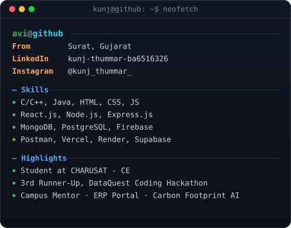

# Hi 👋, I'm Kunj Thummar

### 💻 Computer Engineering Student | Backend Developer | Open Source Enthusiast

  
  
  
  

<!-- hero: monochrome ASCII portrait (types in) beside a neofetch-style info
     panel. regenerate portrait: python scripts/prep_photo.py <photo> &&
     python scripts/make_ascii_svg.py ; info panel: python scripts/make_info_card.py -->
<table>
<tr>
<td valign="top"></td>
<td valign="top"></td>
</tr>
</table>

---

## 🚀 About Me

- 🎓 B.Tech Computer Engineering Student at **CHARUSAT**
- 💻 Passionate Backend Developer
- 🌱 Currently learning **Node.js, Express.js, MongoDB & System Design**
- ⚡ Interested in Backend Development, APIs, and Scalable Applications
- 📫 Reach me on **LinkedIn** or **Instagram**

---

## 🛠️ Tech Stack

---

## 📈 GitHub Activity

---

⭐ **Thanks for visiting my profile!**

